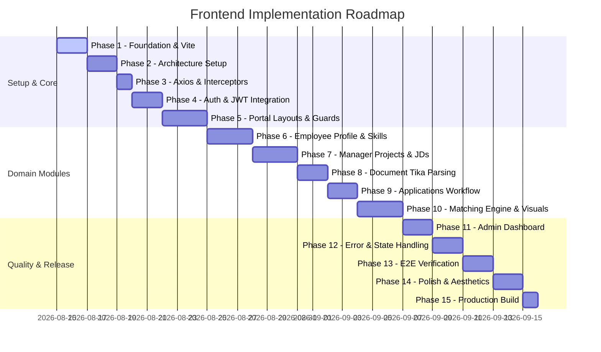

# 🚀 Employee Matching Platform - Frontend Architecture & API Blueprint

> **Notice:** The backend Spring Boot application is the **single source of truth**. This document provides an exhaustive, field-level audit of all backend APIs and a production-grade blueprint for developing the React + Vite frontend without introducing backend modifications or assumptions.

---

# PART 1 — COMPLETE BACKEND API INVENTORY

Below is the complete, exhaustive inventory of all 24 REST API endpoints exposed by the Spring Boot backend.

---

### MODULE 1: Authentication & Authorization

#### Endpoint 1.1: Register User
* **Module:** Authentication
* **Controller Class:** `com.employeematching.controller.AuthController`
* **Endpoint URL:** `/api/auth/register`
* **HTTP Method:** `POST`
* **Path Variables:** None
* **Query Parameters:** None
* **Authentication Required:** No (`permitAll()`)
* **Required Role(s):** None
* **Request DTO:** `RegisterRequest`
  * `name` (`String`, `@NotBlank`)
  * `email` (`String`, `@NotBlank`, `@Email`)
  * `password` (`String`, `@NotBlank`, `@Size(min = 6)`)
* **Response DTO:** `RegisterResponse`
  * `id` (`Long`)
  * `name` (`String`)
  * `email` (`String`)
  * `role` (`User.Role` enum: `EMPLOYEE`, `MANAGER`, `ADMIN`)
* **HTTP Status Codes:** `201 CREATED`, `400 BAD REQUEST`, `409 CONFLICT` (Email already exists)
* **Validation Rules:** Valid email format, password min length 6, non-blank fields.
* **Possible Errors:** Email duplicate conflict, request validation failures.
* **Backend Action:** Hashes password with BCrypt, creates User entity, returns user details.
* **Frontend Usage:** `RegisterPage` component (`/register`). Triggered by submitting the registration form.

#### Endpoint 1.2: Login User
* **Module:** Authentication
* **Controller Class:** `com.employeematching.controller.AuthController`
* **Endpoint URL:** `/api/auth/login`
* **HTTP Method:** `POST`
* **Path Variables:** None
* **Query Parameters:** None
* **Authentication Required:** No (`permitAll()`)
* **Required Role(s):** None
* **Request DTO:** `LoginRequest`
  * `email` (`String`, `@NotBlank`, `@Email`)
  * `password` (`String`, `@NotBlank`)
* **Response DTO:** `LoginResponse`
  * `token` (`String` - JWT Bearer Token)
  * `id` (`Long` - User ID)
  * `name` (`String`)
  * `email` (`String`)
  * `role` (`User.Role` enum: `EMPLOYEE`, `MANAGER`, `ADMIN`)
* **HTTP Status Codes:** `200 OK`, `400 BAD REQUEST`, `401 UNAUTHORIZED` (Invalid credentials)
* **Validation Rules:** Valid email format, non-blank fields.
* **Possible Errors:** Invalid credentials runtime exception.
* **Backend Action:** Verifies password with BCrypt, generates signed JWT with 1-hour expiration containing `email`, `userId`, `role` claims.
* **Frontend Usage:** `LoginPage` component (`/login`). Triggered by submitting login form. Token and user profile saved to LocalStorage / AuthContext.

---

### MODULE 2: Employee Profile Management

#### Endpoint 2.1: Create Employee Profile
* **Module:** Employee
* **Controller Class:** `com.employeematching.controller.EmployeeController`
* **Endpoint URL:** `/api/employees/profile`
* **HTTP Method:** `POST`
* **Path Variables:** None
* **Query Parameters:** None
* **Authentication Required:** Yes (`Bearer <JWT>`)
* **Required Role(s):** `EMPLOYEE`
* **Request DTO:** `EmployeeProfileRequest`
  * `department` (`String`, `@NotBlank`)
  * `designation` (`String`, `@NotBlank`)
  * `experience` (`Double`, `@NotNull`, `@DecimalMin("0.0")`)
* **Response DTO:** `EmployeeProfileResponse`
  * `id` (`Long` - Employee Profile ID)
  * `userId` (`Long` - User ID)
  * `name` (`String`)
  * `email` (`String`)
  * `department` (`String`)
  * `designation` (`String`)
  * `experience` (`double`)
* **HTTP Status Codes:** `201 CREATED`, `400 BAD REQUEST`, `401 UNAUTHORIZED`, `403 FORBIDDEN`, `409 CONFLICT` (Profile already exists)
* **Validation Rules:** Non-blank department & designation, experience $\ge 0.0$.
* **Possible Errors:** Profile already exists for user, User not found.
* **Backend Action:** Associates authenticated user with a new `Employee` record.
* **Frontend Usage:** `CreateEmployeeProfileModal` or `ProfilePage` (`/employee/profile`). Triggered upon first login if profile is incomplete.

#### Endpoint 2.2: Get My Employee Profile
* **Module:** Employee
* **Controller Class:** `com.employeematching.controller.EmployeeController`
* **Endpoint URL:** `/api/employees/profile`
* **HTTP Method:** `GET`
* **Path Variables:** None
* **Query Parameters:** None
* **Authentication Required:** Yes (`Bearer <JWT>`)
* **Required Role(s):** `EMPLOYEE`
* **Request DTO:** None
* **Response DTO:** `EmployeeProfileResponse`
  * `id` (`Long`)
  * `userId` (`Long`)
  * `name` (`String`)
  * `email` (`String`)
  * `department` (`String`)
  * `designation` (`String`)
  * `experience` (`double`)
* **HTTP Status Codes:** `200 OK`, `401 UNAUTHORIZED`, `403 FORBIDDEN`, `404 NOT FOUND` (Profile not found)
* **Backend Action:** Fetches `Employee` record linked to authenticated user ID.
* **Frontend Usage:** `EmployeeDashboard` (`/employee/dashboard`) and `ProfilePage` (`/employee/profile`). Triggered on page load.

---

### MODULE 3: Manager Profile Management

#### Endpoint 3.1: Create Manager Profile
* **Module:** Manager
* **Controller Class:** `com.employeematching.controller.ManagerController`
* **Endpoint URL:** `/api/managers/profile`
* **HTTP Method:** `POST`
* **Path Variables:** None
* **Query Parameters:** None
* **Authentication Required:** Yes (`Bearer <JWT>`)
* **Required Role(s):** `MANAGER`
* **Request DTO:** `ManagerProfileRequest`
  * `department` (`String`, `@NotBlank`)
  * `designation` (`String`, `@NotBlank`)
* **Response DTO:** `ManagerProfileResponse`
  * `id` (`Long` - Manager Profile ID)
  * `userId` (`Long`)
  * `name` (`String`)
  * `email` (`String`)
  * `department` (`String`)
  * `designation` (`String`)
* **HTTP Status Codes:** `201 CREATED`, `400 BAD REQUEST`, `401 UNAUTHORIZED`, `403 FORBIDDEN`, `409 CONFLICT`
* **Validation Rules:** Non-blank department and designation.
* **Backend Action:** Associates authenticated user with a new `Manager` record.
* **Frontend Usage:** `ManagerProfileSetupPage` (`/manager/profile`). Triggered on first manager login.

#### Endpoint 3.2: Get My Manager Profile
* **Module:** Manager
* **Controller Class:** `com.employeematching.controller.ManagerController`
* **Endpoint URL:** `/api/managers/profile`
* **HTTP Method:** `GET`
* **Path Variables:** None
* **Query Parameters:** None
* **Authentication Required:** Yes (`Bearer <JWT>`)
* **Required Role(s):** `MANAGER`
* **Request DTO:** None
* **Response DTO:** `ManagerProfileResponse`
  * `id` (`Long`)
  * `userId` (`Long`)
  * `name` (`String`)
  * `email` (`String`)
  * `department` (`String`)
  * `designation` (`String`)
* **HTTP Status Codes:** `200 OK`, `401 UNAUTHORIZED`, `403 FORBIDDEN`, `404 NOT FOUND`
* **Backend Action:** Fetches `Manager` profile for authenticated user.
* **Frontend Usage:** `ManagerDashboard` (`/manager/dashboard`). Triggered on dashboard load.

---

### MODULE 4: Skills Catalogue & Employee Skills

#### Endpoint 4.1: Search / List Global Skills
* **Module:** Skills
* **Controller Class:** `com.employeematching.controller.SkillController`
* **Endpoint URL:** `/api/skills`
* **HTTP Method:** `GET`
* **Path Variables:** None
* **Query Parameters:** `name` (`String`, optional - search filter)
* **Authentication Required:** Yes (`Bearer <JWT>`)
* **Required Role(s):** `EMPLOYEE`, `MANAGER`, `ADMIN`
* **Request DTO:** None
* **Response DTO:** `List<SkillResponse>`
  * `id` (`Long`)
  * `name` (`String`)
* **HTTP Status Codes:** `200 OK`, `401 UNAUTHORIZED`
* **Backend Action:** Performs case-insensitive skill name search or returns all skills.
* **Frontend Usage:** Skill autocomplete dropdowns in `EmployeeSkillsPage` and `ProjectSkillsModal`.

#### Endpoint 4.2: Add Employee Skill
* **Module:** Employee Skills
* **Controller Class:** `com.employeematching.controller.EmployeeSkillController`
* **Endpoint URL:** `/api/employees/skills`
* **HTTP Method:** `POST`
* **Path Variables:** None
* **Query Parameters:** None
* **Authentication Required:** Yes (`Bearer <JWT>`)
* **Required Role(s):** `EMPLOYEE`
* **Request DTO:** `EmployeeSkillRequest`
  * `skillName` (`String`, `@NotBlank`)
  * `proficiency` (`Integer`, `@NotNull`, `@Min(1)`, `@Max(10)`)
  * `yearsExperience` (`Double`, `@NotNull`, `@Min(0)`)
* **Response DTO:** `EmployeeSkillResponse`
  * `id` (`Long` - EmployeeSkill ID)
  * `skillId` (`Long`)
  * `skillName` (`String`)
  * `proficiency` (`int`)
  * `yearsExperience` (`double`)
* **HTTP Status Codes:** `201 CREATED`, `400 BAD REQUEST`, `401 UNAUTHORIZED`, `403 FORBIDDEN`
* **Backend Action:** Finds or creates global skill by name, links it to Employee with proficiency & experience.
* **Frontend Usage:** `AddSkillForm` component inside `EmployeeSkillsPage` (`/employee/skills`).

#### Endpoint 4.3: Get My Employee Skills
* **Module:** Employee Skills
* **Controller Class:** `com.employeematching.controller.EmployeeSkillController`
* **Endpoint URL:** `/api/employees/skills`
* **HTTP Method:** `GET`
* **Path Variables:** None
* **Query Parameters:** None
* **Authentication Required:** Yes (`Bearer <JWT>`)
* **Required Role(s):** `EMPLOYEE`
* **Request DTO:** None
* **Response DTO:** `List<EmployeeSkillResponse>`
* **HTTP Status Codes:** `200 OK`, `401 UNAUTHORIZED`, `403 FORBIDDEN`
* **Backend Action:** Fetches list of skills for the logged-in employee.
* **Frontend Usage:** `EmployeeSkillsPage` (`/employee/skills`).

---

### MODULE 5: Projects & Required Skills

#### Endpoint 5.1: Create Project (Manager)
* **Module:** Projects
* **Controller Class:** `com.employeematching.controller.ProjectController`
* **Endpoint URL:** `/api/managers/projects`
* **HTTP Method:** `POST`
* **Authentication Required:** Yes (`Bearer <JWT>`)
* **Required Role(s):** `MANAGER`
* **Request DTO:** `ProjectRequest`
  * `title` (`String`, `@NotBlank`)
  * `description` (`String`, `@NotBlank`)
  * `department` (`String`, `@NotBlank`)
  * `location` (`String`, `@NotBlank`)
  * `experienceRequired` (`Double`, `@NotNull`, `@PositiveOrZero`)
* **Response DTO:** `ProjectResponse`
  * `id` (`Long`)
  * `managerId` (`Long`)
  * `title` (`String`)
  * `description` (`String`)
  * `department` (`String`)
  * `location` (`String`)
  * `experienceRequired` (`double`)
  * `status` (`String` - `OPEN` / `CLOSED`)
* **HTTP Status Codes:** `201 CREATED`, `400 BAD REQUEST`, `401 UNAUTHORIZED`, `403 FORBIDDEN`
* **Frontend Usage:** `CreateProjectPage` / `ProjectForm` (`/manager/projects/new`).

#### Endpoint 5.2: Get My Managed Projects
* **Module:** Projects
* **Controller Class:** `com.employeematching.controller.ProjectController`
* **Endpoint URL:** `/api/managers/projects`
* **HTTP Method:** `GET`
* **Authentication Required:** Yes (`Bearer <JWT>`)
* **Required Role(s):** `MANAGER`
* **Request DTO:** None
* **Response DTO:** `List<ProjectResponse>`
* **HTTP Status Codes:** `200 OK`, `401 UNAUTHORIZED`, `403 FORBIDDEN`
* **Frontend Usage:** `ManagerProjectsPage` (`/manager/projects`).

#### Endpoint 5.3: Add Required Project Skill
* **Module:** Project Skills
* **Controller Class:** `com.employeematching.controller.ProjectSkillController`
* **Endpoint URL:** `/api/managers/project-skills`
* **HTTP Method:** `POST`
* **Authentication Required:** Yes (`Bearer <JWT>`)
* **Required Role(s):** `MANAGER`
* **Request DTO:** `ProjectSkillRequest`
  * `projectId` (`Long`, `@NotNull`)
  * `skillName` (`String`, `@NotBlank`)
  * `requiredProficiency` (`Integer`, `@NotNull`, `@Min(1)`, `@Max(5)`)
  * `importance` (`Integer`, `@NotNull`, `@Min(1)`, `@Max(5)`)
* **Response DTO:** `ProjectSkillResponse`
  * `id` (`Long`)
  * `projectId` (`Long`)
  * `skillId` (`Long`)
  * `skillName` (`String`)
  * `requiredProficiency` (`int`)
  * `importance` (`int`)
* **HTTP Status Codes:** `201 CREATED`, `400 BAD REQUEST`, `401 UNAUTHORIZED`, `403 FORBIDDEN`, `409 CONFLICT`
* **Frontend Usage:** `ProjectDetailsPage` (`/manager/projects/:id`).

#### Endpoint 5.4: Get Project Required Skills
* **Module:** Project Skills
* **Controller Class:** `com.employeematching.controller.ProjectSkillController`
* **Endpoint URL:** `/api/managers/project-skills/project/{projectId}`
* **HTTP Method:** `GET`
* **Path Variables:** `projectId` (`Long`)
* **Authentication Required:** Yes (`Bearer <JWT>`)
* **Required Role(s):** `MANAGER`
* **Response DTO:** `List<ProjectSkillResponse>`
* **HTTP Status Codes:** `200 OK`, `401 UNAUTHORIZED`, `403 FORBIDDEN`, `404 NOT FOUND`
* **Frontend Usage:** `ProjectDetailsPage` (`/manager/projects/:id`).

#### Endpoint 5.5: Update Required Project Skill
* **Module:** Project Skills
* **Controller Class:** `com.employeematching.controller.ProjectSkillController`
* **Endpoint URL:** `/api/managers/project-skills/{id}`
* **HTTP Method:** `PUT`
* **Path Variables:** `id` (`Long` - ProjectSkill ID)
* **Authentication Required:** Yes (`Bearer <JWT>`)
* **Required Role(s):** `MANAGER`
* **Request DTO:** `ProjectSkillRequest`
* **Response DTO:** `ProjectSkillResponse`
* **HTTP Status Codes:** `200 OK`, `400 BAD REQUEST`, `401 UNAUTHORIZED`, `403 FORBIDDEN`, `404 NOT FOUND`
* **Frontend Usage:** Edit Required Skill dialog on `ProjectDetailsPage`.

#### Endpoint 5.6: Get Open Projects (Employee Discovery)
* **Module:** Project Discovery
* **Controller Class:** `com.employeematching.controller.ProjectDiscoveryController`
* **Endpoint URL:** `/api/projects/open`
* **HTTP Method:** `GET`
* **Authentication Required:** Yes (`Bearer <JWT>`)
* **Required Role(s):** Authenticated Users
* **Response DTO:** `List<ProjectResponse>`
* **HTTP Status Codes:** `200 OK`, `401 UNAUTHORIZED`
* **Frontend Usage:** `ProjectExplorePage` (`/employee/projects`).

#### Endpoint 5.7: Get Recommended Projects for Employee
* **Module:** Project Discovery
* **Controller Class:** `com.employeematching.controller.ProjectDiscoveryController`
* **Endpoint URL:** `/api/projects/recommendations`
* **HTTP Method:** `GET`
* **Authentication Required:** Yes (`Bearer <JWT>`)
* **Required Role(s):** Authenticated Users (`EMPLOYEE`)
* **Response DTO:** `List<MatchResultResponse>`
  * `id` (`Long`)
  * `employeeId` (`Long`)
  * `projectId` (`Long`)
  * `projectTitle` (`String`)
  * `matchScore` (`double` - % 0-100)
  * `skillsScore` (`double` 0.0-1.0)
  * `experienceScore` (`double` 0.0-1.0)
  * `certificationScore` (`double` 0.0-1.0)
  * `availabilityScore` (`double` 0.0-1.0)
  * `preferenceScore` (`double` 0.0-1.0)
  * `generatedAt` (`String`)
* **HTTP Status Codes:** `200 OK`, `401 UNAUTHORIZED`
* **Frontend Usage:** `EmployeeDashboard` (`/employee/dashboard`) "Recommended Projects" widget.

---

### MODULE 6: Resumes & Job Description Skill Processing

#### Endpoint 6.1: Upload Employee Resume
* **Module:** Resume
* **Controller Class:** `com.employeematching.controller.ResumeController`
* **Endpoint URL:** `/api/employees/resume`
* **HTTP Method:** `POST`
* **Request Format:** `multipart/form-data`
* **Form Param:** `file` (`MultipartFile` - PDF/Word/TXT document)
* **Authentication Required:** Yes (`Bearer <JWT>`)
* **Required Role(s):** `EMPLOYEE`
* **Response DTO:** `ResumeResponse`
  * `id` (`Long`)
  * `employeeId` (`Long`)
  * `fileName` (`String`)
  * `processingStatus` (`String` - `UNPROCESSED`)
  * `uploadedAt` (`String`)
* **HTTP Status Codes:** `201 CREATED`, `400 BAD REQUEST`, `401 UNAUTHORIZED`
* **Frontend Usage:** `ResumeManagerPage` (`/employee/resume`).

#### Endpoint 6.2: Get My Resumes
* **Module:** Resume
* **Controller Class:** `com.employeematching.controller.ResumeController`
* **Endpoint URL:** `/api/employees/resume`
* **HTTP Method:** `GET`
* **Authentication Required:** Yes (`Bearer <JWT>`)
* **Required Role(s):** `EMPLOYEE`
* **Response DTO:** `List<ResumeResponse>`
* **HTTP Status Codes:** `200 OK`, `401 UNAUTHORIZED`
* **Frontend Usage:** `ResumeManagerPage` (`/employee/resume`).

#### Endpoint 6.3: Process Resume (Extract Skills with Apache Tika)
* **Module:** Resume
* **Controller Class:** `com.employeematching.controller.ResumeController`
* **Endpoint URL:** `/api/employees/resume/{resumeId}/process`
* **HTTP Method:** `POST`
* **Path Variables:** `resumeId` (`Long`)
* **Authentication Required:** Yes (`Bearer <JWT>`)
* **Required Role(s):** `EMPLOYEE`
* **Response DTO:** `ResumeProcessingResponse`
  * `resumeId` (`Long`)
  * `processingStatus` (`String` - `PROCESSED` / `FAILED`)
  * `detectedSkills` (`List<SkillResponse>`)
* **HTTP Status Codes:** `200 OK`, `401 UNAUTHORIZED`, `403 FORBIDDEN`, `404 NOT FOUND`
* **Backend Action:** Parses document text using Tika, matches text against system skills, automatically adds new skills to employee profile with default proficiency=3, experience=1.0.
* **Frontend Usage:** "Parse & Extract Skills" button on `ResumeManagerPage`.

#### Endpoint 6.4: Upload Job Description (Manager)
* **Module:** Job Description
* **Controller Class:** `com.employeematching.controller.JobDescriptionController`
* **Endpoint URL:** `/api/managers/projects/{projectId}/job-description`
* **HTTP Method:** `POST`
* **Request Format:** `multipart/form-data`
* **Form Param:** `file` (`MultipartFile`)
* **Authentication Required:** Yes (`Bearer <JWT>`)
* **Required Role(s):** `MANAGER`
* **Response DTO:** `JobDescriptionResponse`
  * `id` (`Long`)
  * `projectId` (`Long`)
  * `fileName` (`String`)
  * `processingStatus` (`String` - `UNPROCESSED`)
  * `uploadedAt` (`String`)
* **HTTP Status Codes:** `201 CREATED`, `400 BAD REQUEST`, `401 UNAUTHORIZED`
* **Frontend Usage:** `ProjectDetailsPage` (`/manager/projects/:id`).

#### Endpoint 6.5: Get Project Job Description
* **Module:** Job Description
* **Controller Class:** `com.employeematching.controller.JobDescriptionController`
* **Endpoint URL:** `/api/managers/projects/{projectId}/job-description`
* **HTTP Method:** `GET`
* **Path Variables:** `projectId` (`Long`)
* **Authentication Required:** Yes (`Bearer <JWT>`)
* **Required Role(s):** `MANAGER`
* **Response DTO:** `JobDescriptionResponse`
* **HTTP Status Codes:** `200 OK`, `401 UNAUTHORIZED`, `404 NOT FOUND`
* **Frontend Usage:** `ProjectDetailsPage` (`/manager/projects/:id`).

#### Endpoint 6.6: Process Job Description (Extract Skills for Project)
* **Module:** Job Description
* **Controller Class:** `com.employeematching.controller.JobDescriptionController`
* **Endpoint URL:** `/api/managers/projects/{projectId}/job-description/process`
* **HTTP Method:** `POST`
* **Path Variables:** `projectId` (`Long`)
* **Authentication Required:** Yes (`Bearer <JWT>`)
* **Required Role(s):** `MANAGER`
* **Response DTO:** `JobDescriptionProcessingResponse`
  * `projectId` (`Long`)
  * `status` (`String` - `PROCESSED`)
  * `detectedSkills` (`List<SkillResponse>`)
* **HTTP Status Codes:** `200 OK`, `401 UNAUTHORIZED`, `403 FORBIDDEN`, `404 NOT FOUND`
* **Backend Action:** Parses document text, auto-populates project required skills with default proficiency=1, importance=1.
* **Frontend Usage:** "Process JD Document" button on `ProjectDetailsPage`.

---

### MODULE 7: Certifications & Education

#### Endpoint 7.1: Add Certification
* **Module:** Certifications
* **Controller Class:** `com.employeematching.controller.CertificationController`
* **Endpoint URL:** `/api/certifications`
* **HTTP Method:** `POST`
* **Authentication Required:** Yes (`Bearer <JWT>`)
* **Required Role(s):** `EMPLOYEE`
* **Request DTO:** `CertificationRequest`
  * `name` (`String`, `@NotBlank`)
  * `issuingOrganization` (`String`, `@NotBlank`)
  * `issueDate` (`String`, `@NotBlank`)
  * `expiryDate` (`String`, optional)
* **Response DTO:** `CertificationResponse`
  * `id` (`Long`)
  * `employeeId` (`Long`)
  * `name` (`String`)
  * `issuingOrganization` (`String`)
  * `issueDate` (`String`)
  * `expiryDate` (`String`)
* **HTTP Status Codes:** `201 CREATED`, `400 BAD REQUEST`, `401 UNAUTHORIZED`
* **Frontend Usage:** `EmployeeQualificationsPage` (`/employee/qualifications`).

#### Endpoint 7.2: Get My Certifications
* **Module:** Certifications
* **Controller Class:** `com.employeematching.controller.CertificationController`
* **Endpoint URL:** `/api/certifications`
* **HTTP Method:** `GET`
* **Authentication Required:** Yes (`Bearer <JWT>`)
* **Required Role(s):** `EMPLOYEE`
* **Response DTO:** `List<CertificationResponse>`
* **HTTP Status Codes:** `200 OK`, `401 UNAUTHORIZED`
* **Frontend Usage:** `EmployeeQualificationsPage`.

#### Endpoint 7.3: Get Certification By ID
* **Module:** Certifications
* **Endpoint URL:** `/api/certifications/{id}` | `GET` | Response: `CertificationResponse`

#### Endpoint 7.4: Update Certification
* **Module:** Certifications
* **Endpoint URL:** `/api/certifications/{id}` | `PUT` | Request: `CertificationRequest` | Response: `CertificationResponse`

#### Endpoint 7.5: Delete Certification
* **Module:** Certifications
* **Endpoint URL:** `/api/certifications/{id}` | `DELETE` | Response: `204 NO CONTENT`

#### Endpoint 7.6: Add Education
* **Module:** Education
* **Controller Class:** `com.employeematching.controller.EducationController`
* **Endpoint URL:** `/api/employees/education`
* **HTTP Method:** `POST`
* **Authentication Required:** Yes (`Bearer <JWT>`)
* **Required Role(s):** `EMPLOYEE`
* **Request DTO:** `EducationRequest`
  * `degree` (`String`, `@NotBlank`)
  * `field` (`String`, `@NotBlank`)
  * `institution` (`String`, `@NotBlank`)
  * `graduationYear` (`Integer`, `@NotNull`, `@Min(1900)`, `@Max(2100)`)
* **Response DTO:** `EducationResponse`
  * `id` (`Long`)
  * `employeeId` (`Long`)
  * `degree` (`String`)
  * `field` (`String`)
  * `institution` (`String`)
  * `graduationYear` (`Integer`)
* **HTTP Status Codes:** `201 CREATED`, `400 BAD REQUEST`, `401 UNAUTHORIZED`
* **Frontend Usage:** `EmployeeQualificationsPage`.

#### Endpoint 7.7: Get My Education List
* **Endpoint URL:** `/api/employees/education` | `GET` | Response: `List<EducationResponse>`

#### Endpoint 7.8: Get Education By ID
* **Endpoint URL:** `/api/employees/education/{id}` | `GET` | Response: `EducationResponse`

#### Endpoint 7.9: Update Education
* **Endpoint URL:** `/api/employees/education/{id}` | `PUT` | Request: `EducationRequest` | Response: `EducationResponse`

#### Endpoint 7.10: Delete Education
* **Endpoint URL:** `/api/employees/education/{id}` | `DELETE` | Response: `204 NO CONTENT`

---

### MODULE 8: Algorithmic Matching Engine

#### Endpoint 8.1: Calculate Single Employee & Project Match
* **Module:** Match Results
* **Controller Class:** `com.employeematching.controller.MatchResultController`
* **Endpoint URL:** `/api/match-results/calculate`
* **HTTP Method:** `POST`
* **Authentication Required:** Yes (`Bearer <JWT>`)
* **Required Role(s):** `EMPLOYEE`, `MANAGER`, `ADMIN`
* **Request DTO:** `MatchCalculationRequest`
  * `employeeId` (`Long`, `@NotNull`)
  * `projectId` (`Long`, `@NotNull`)
* **Response DTO:** `MatchResultResponse`
* **HTTP Status Codes:** `200 OK`, `400 BAD REQUEST`, `401 UNAUTHORIZED`, `403 FORBIDDEN`
* **Frontend Usage:** "Run Match Analysis" button on Project Candidate Match view.

#### Endpoint 8.2: Calculate All Candidate Matches for a Project (Manager)
* **Module:** Match Results
* **Controller Class:** `com.employeematching.controller.MatchResultController`
* **Endpoint URL:** `/api/match-results/project/{projectId}/calculate-all`
* **HTTP Method:** `POST`
* **Path Variables:** `projectId` (`Long`)
* **Authentication Required:** Yes (`Bearer <JWT>`)
* **Required Role(s):** `MANAGER`, `ADMIN`
* **Response DTO:** `List<MatchResultResponse>` (Sorted descending by `matchScore`)
* **HTTP Status Codes:** `200 OK`, `401 UNAUTHORIZED`, `403 FORBIDDEN`
* **Frontend Usage:** `ProjectMatchCandidatesPage` (`/manager/projects/:id/candidates`).

#### Endpoint 8.3: Get My Match Results (Employee)
* **Module:** Match Results
* **Endpoint URL:** `/api/match-results/my-matches` | `GET` | Response: `List<MatchResultResponse>`
* **Frontend Usage:** `EmployeeMatchesPage` (`/employee/matches`).

#### Endpoint 8.4: Get Saved Match Results for a Project (Manager)
* **Module:** Match Results
* **Endpoint URL:** `/api/match-results/project/{projectId}` | `GET` | Response: `List<MatchResultResponse>`
* **Frontend Usage:** `ProjectMatchCandidatesPage` (`/manager/projects/:id/candidates`).

#### Endpoint 8.5: Get Recommended Candidates for Project
* **Module:** Match Results
* **Endpoint URL:** `/api/match-results/project/{projectId}/recommended` | `GET` | Response: `List<MatchResultResponse>`

#### Endpoint 8.6: Get Match Result By ID
* **Module:** Match Results
* **Endpoint URL:** `/api/match-results/{id}` | `GET` | Response: `MatchResultResponse`

#### Endpoint 8.7: Get Match Score Detailed Explanation
* **Module:** Match Results
* **Controller Class:** `com.employeematching.controller.MatchResultController`
* **Endpoint URL:** `/api/match-results/{id}/explanation`
* **HTTP Method:** `GET`
* **Path Variables:** `id` (`Long` - MatchResult ID)
* **Authentication Required:** Yes (`Bearer <JWT>`)
* **Required Role(s):** `EMPLOYEE`, `MANAGER`, `ADMIN`
* **Response DTO:** `MatchExplanationResponse`
  * `matchResultId` (`Long`)
  * `employeeId` (`Long`)
  * `projectId` (`Long`)
  * `projectTitle` (`String`)
  * `overallMatchScore` (`double`)
  * `skillsScore` (`double`), `experienceScore` (`double`), `certificationScore` (`double`), `availabilityScore` (`double`), `preferenceScore` (`double`)
  * `skillsPoints` (`double` / 50.0), `experiencePoints` (`double` / 30.0), `certificationPoints` (`double` / 10.0), `availabilityPoints` (`double` / 5.0), `preferencePoints` (`double` / 5.0)
  * `matchedSkills` (`List<String>`)
  * `missingSkills` (`List<String>`)
  * `generatedAt` (`String`)
* **HTTP Status Codes:** `200 OK`, `401 UNAUTHORIZED`, `403 FORBIDDEN`, `404 NOT FOUND`
* **Frontend Usage:** `MatchExplanationModal` component.

#### Endpoint 8.8: Delete Match Result
* **Module:** Match Results
* **Endpoint URL:** `/api/match-results/{id}` | `DELETE` | Response: `204 NO CONTENT`

---

### MODULE 9: Project Applications

#### Endpoint 9.1: Apply to Project (Employee)
* **Module:** Applications
* **Controller Class:** `com.employeematching.controller.ApplicationController`
* **Endpoint URL:** `/api/applications`
* **HTTP Method:** `POST`
* **Authentication Required:** Yes (`Bearer <JWT>`)
* **Required Role(s):** `EMPLOYEE`
* **Request DTO:** `ApplicationRequest`
  * `projectId` (`Long`, `@NotNull`)
* **Response DTO:** `ApplicationResponse`
  * `id` (`Long`)
  * `projectId` (`Long`)
  * `employeeId` (`Long`)
  * `status` (`String` - `PENDING`)
* **HTTP Status Codes:** `201 CREATED`, `400 BAD REQUEST`, `401 UNAUTHORIZED`, `409 CONFLICT` (Already applied)
* **Frontend Usage:** "Apply Now" button on `ProjectExplorePage`.

#### Endpoint 9.2: Get My Submitted Applications
* **Module:** Applications
* **Endpoint URL:** `/api/applications/my` | `GET` | Response: `List<ApplicationResponse>`
* **Frontend Usage:** `EmployeeApplicationsPage` (`/employee/applications`).

#### Endpoint 9.3: Get Applications Received for Project (Manager)
* **Module:** Applications
* **Endpoint URL:** `/api/applications/project/{projectId}` | `GET` | Response: `List<ApplicationResponse>`
* **Frontend Usage:** `ProjectApplicationsPage` (`/manager/projects/:id/applications`).

#### Endpoint 9.4: Review Application Status (Manager)
* **Module:** Applications
* **Controller Class:** `com.employeematching.controller.ApplicationController`
* **Endpoint URL:** `/api/applications/{applicationId}/review`
* **HTTP Method:** `PUT`
* **Path Variables:** `applicationId` (`Long`)
* **Authentication Required:** Yes (`Bearer <JWT>`)
* **Required Role(s):** `MANAGER`, `ADMIN`
* **Request DTO:** `ApplicationReviewRequest`
  * `status` (`String`, `@NotBlank` - `ACCEPTED` or `REJECTED`)
* **Response DTO:** `ApplicationReviewResponse`
  * `id` (`Long`)
  * `projectId` (`Long`)
  * `employeeId` (`Long`)
  * `status` (`String` - `ACCEPTED` / `REJECTED`)
* **HTTP Status Codes:** `200 OK`, `400 BAD REQUEST`, `401 UNAUTHORIZED`, `403 FORBIDDEN`
* **Frontend Usage:** Accept / Reject action buttons on `ProjectApplicationsPage`.

---

### MODULE 10: Administration & Metrics

#### Endpoint 10.1: Get All System Users
* **Module:** Admin
* **Controller Class:** `com.employeematching.controller.AdminController`
* **Endpoint URL:** `/api/admin/users` | `GET` | Response: `List<UserResponse>`
  * `id` (`Long`), `name` (`String`), `email` (`String`), `role` (`User.Role`)
* **Authentication Required:** Yes | Role: `ADMIN`
* **Frontend Usage:** `AdminUserManagementPage` (`/admin/users`).

#### Endpoint 10.2: Get User By ID
* **Module:** Admin
* **Endpoint URL:** `/api/admin/users/{id}` | `GET` | Response: `UserResponse`

#### Endpoint 10.3: Get System Dashboard Statistics
* **Module:** Admin
* **Controller Class:** `com.employeematching.controller.AdminController`
* **Endpoint URL:** `/api/admin/stats` | `GET`
* **Authentication Required:** Yes | Role: `ADMIN`
* **Response DTO:** `AdminStatsResponse`
  * `totalUsers` (`long`), `totalEmployees` (`long`), `totalManagers` (`long`), `totalProjects` (`long`), `openProjects` (`long`), `totalApplications` (`long`), `totalSkills` (`long`), `totalMatchResults` (`long`)
* **Frontend Usage:** `AdminDashboardPage` (`/admin/dashboard`).

---

# PART 2 — BACKEND MODULE INVENTORY

| Module Name | Core Entity | Primary Service | Primary Controller | Roles | Key Business Rules |
| :--- | :--- | :--- | :--- | :--- | :--- |
| **Auth** | `User` | `AuthService` | `AuthController` | Public | Password stored as BCrypt hash; JWT issued with 1-hour expiration. |
| **Employee** | `Employee` | `EmployeeService` | `EmployeeController` | `EMPLOYEE` | 1-to-1 with User. Unique user profile requirement. |
| **Manager** | `Manager` | `ManagerService` | `ManagerController` | `MANAGER` | 1-to-1 with User. Manages projects. |
| **Skill Catalogue**| `Skill` | `SkillService` | `SkillController` | All | Unique skill names. Auto-created if missing during skill addition. |
| **Employee Skill** | `EmployeeSkill` | `EmployeeSkillService` | `EmployeeSkillController` | `EMPLOYEE` | Junction entity. Proficiency rated 1-10; years exp $\ge 0.0$. |
| **Project** | `Project` | `ProjectService` | `ProjectController` | `MANAGER` | Defaults to status `OPEN`. Required experience specified in years. |
| **Project Skill** | `ProjectSkill` | `ProjectSkillService` | `ProjectSkillController` | `MANAGER` | Junction entity. Proficiency 1-5; Importance weight 1-5. |
| **Resume Parsing**| `Resume` | `ResumeProcessingService`| `ResumeController` | `EMPLOYEE` | File uploaded to `./uploads/resumes/`. Tika extracts text to auto-populate employee skills. |
| **JD Processing** | `JobDescription` | `JobDescriptionProcessingService` | `JobDescriptionController` | `MANAGER` | File uploaded to `./uploads/job-descriptions/`. Auto-populates project required skills. |
| **Certifications** | `Certification` | `CertificationService` | `CertificationController` | `EMPLOYEE` | Active certs boost matching score by up to 10%. |
| **Education** | `Education` | `EducationService` | `EducationController` | `EMPLOYEE` | Stores academic qualification history. |
| **Matching Engine**| `MatchResult` | `MatchResultService` | `MatchResultController` | All | Algorithmic weighted evaluation engine (50% Skills, 30% Exp, 10% Certs, 5% Avail, 5% Dept). |
| **Applications** | `Application` | `ApplicationService` | `ApplicationController` | `EMPLOYEE`, `MANAGER` | Can only apply once per OPEN project. Status transitions from `PENDING` to `ACCEPTED`/`REJECTED`. |
| **Admin** | N/A | `AdminService` | `AdminController` | `ADMIN` | Full visibility over system stats and user registrations. |

---

# PART 3 — AUTHENTICATION & AUTHORIZATION ANALYSIS

### JWT & Spring Security Mechanics

1. **Authentication Filter (`JwtAuthenticationFilter.java`):**
   * Reads standard HTTP Header: `Authorization: Bearer <token>`
   * Extracts `email` and `role` claims from JWT.
   * Attaches authority to Spring context as `ROLE_<ROLE_NAME>` (e.g., `ROLE_EMPLOYEE`, `ROLE_MANAGER`, `ROLE_ADMIN`).
2. **Token Lifetime:** 3,600,000 ms (1 Hour).
3. **Secret Key Configuration:** Configured in `application.properties` via `jwt.secret`.
4. **Token Refresh Mechanism:** ⚠️ **MISSING / BACKEND CHANGE REQUIRED** if silent token refresh is desired. Currently, users must re-authenticate upon token expiry after 60 minutes.
5. **Logout Mechanism:** Client-side token destruction (removing token from LocalStorage/SessionState).

### React Integration Requirement
* All protected Axios calls must attach the JWT token in an interceptor:
```js
config.headers.Authorization = `Bearer ${token}`;
```
* Role parsing from `LoginResponse` or decoded JWT payload dictates route accessibility.

---

# PART 4 — COMPLETE FRONTEND PAGE MAP

```mermaid
graph TD
    Root[/] --> Login[/login]
    Root --> Register[/register]
    
    subgraph Employee Portal
        Login -->|ROLE_EMPLOYEE| EmpDash[/employee/dashboard]
        EmpDash --> EmpProfile[/employee/profile]
        EmpDash --> EmpSkills[/employee/skills]
        EmpDash --> EmpQual[/employee/qualifications]
        EmpDash --> EmpResume[/employee/resume]
        EmpDash --> EmpProj[/employee/projects]
        EmpDash --> EmpApps[/employee/applications]
        EmpDash --> EmpMatches[/employee/matches]
    end
    
    subgraph Manager Portal
        Login -->|ROLE_MANAGER| MgrDash[/manager/dashboard]
        MgrDash --> MgrProfile[/manager/profile]
        MgrDash --> MgrProj[/manager/projects]
        MgrProj --> MgrProjDet[/manager/projects/:id]
        MgrProjDet --> MgrCand[/manager/projects/:id/candidates]
        MgrProjDet --> MgrApps[/manager/projects/:id/applications]
    end

    subgraph Admin Portal
        Login -->|ROLE_ADMIN| AdmDash[/admin/dashboard]
        AdmDash --> AdmUsers[/admin/users]
    end
```

### Employee Pages
1. **`LoginPage`** (`/login`): Public. Login form (`email`, `password`). Calls `/api/auth/login`.
2. **`RegisterPage`** (`/register`): Public. User registration form (`name`, `email`, `password`). Calls `/api/auth/register`.
3. **`EmployeeDashboardPage`** (`/employee/dashboard`): `EMPLOYEE`. Displays profile summary, skill metrics, recommended projects, recent applications.
4. **`EmployeeProfilePage`** (`/employee/profile`): `EMPLOYEE`. Setup/edit employee profile (`department`, `designation`, `experience`).
5. **`EmployeeSkillsPage`** (`/employee/skills`): `EMPLOYEE`. Manage personal skills catalogue, ratings (1-10), and experience years.
6. **`EmployeeQualificationsPage`** (`/employee/qualifications`): `EMPLOYEE`. CRUD operations for Certifications & Education history.
7. **`ResumeManagerPage`** (`/employee/resume`): `EMPLOYEE`. File uploader for resume PDF/Doc, list resumes, and trigger Tika Skill Extraction.
8. **`ProjectExplorePage`** (`/employee/projects`): `EMPLOYEE`. Discover open projects across departments and submit project applications.
9. **`EmployeeApplicationsPage`** (`/employee/applications`): `EMPLOYEE`. Track status of applied projects (`PENDING`, `ACCEPTED`, `REJECTED`).
10. **`EmployeeMatchesPage`** (`/employee/matches`): `EMPLOYEE`. View calculated project match scores and request score explanations.

### Manager Pages
11. **`ManagerDashboardPage`** (`/manager/dashboard`): `MANAGER`. Overview of managed projects, total candidate applications, quick actions.
12. **`ManagerProfilePage`** (`/manager/profile`): `MANAGER`. Setup department & designation.
13. **`ManagerProjectsPage`** (`/manager/projects`): `MANAGER`. List created projects, button to create new project.
14. **`CreateProjectPage`** (`/manager/projects/new`): `MANAGER`. Form to publish a project position.
15. **`ProjectDetailsPage`** (`/manager/projects/:id`): `MANAGER`. Workspace to upload JD document, parse JD skills, manage required skills list.
16. **`ProjectMatchCandidatesPage`** (`/manager/projects/:id/candidates`): `MANAGER`. Run candidate matching algorithm, inspect candidate fit %, view match explanation breakdowns.
17. **`ProjectApplicationsPage`** (`/manager/projects/:id/applications`): `MANAGER`. Review candidate applications and accept or reject candidates.

### Admin Pages
18. **`AdminDashboardPage`** (`/admin/dashboard`): `ADMIN`. System-wide analytics widgets (total users, active projects, applications count).
19. **`AdminUserManagementPage`** (`/admin/users`): `ADMIN`. Complete user roster table with role details.

---

# PART 5 — API → FRONTEND MAPPING

```
[ POST /api/auth/login ] -------------> AuthContext (Global Token & Role State)
[ GET /api/employees/profile ] ------> EmployeeDashboard & ProfilePage
[ GET /api/skills ] -----------------> AutoComplete Controls (EmployeeSkills & ProjectSkills)
[ POST /api/employees/resume/... ] -> ResumeManagerPage (Apache Tika Skill Parsing)
[ POST /api/match-results/... ] ----> ProjectMatchCandidatesPage (Score Engine)
[ PUT /api/applications/:id/review ]-> ProjectApplicationsPage (Manager Acceptance)
```

---

# PART 6 — FRONTEND PROJECT ARCHITECTURE

Proposed React + Vite Directory Tree:

```
src/
├── assets/                  # Static graphics, branding icons, logos
├── components/              # Shared UI components
│   ├── common/              # Buttons, Cards, Inputs, Modals, Loading Spinners
│   ├── layout/              # Navbar, Sidebar, PageContainer, Footer
│   └── feedback/            # Alert Banners, Toast Notifications, Empty States
├── context/                 # Global React Contexts
│   ├── AuthContext.jsx      # Holds Token, User Info, Login/Logout Logic
│   └── ThemeContext.jsx     # UI Mode Context
├── hooks/                   # Custom Utility Hooks
│   ├── useAuth.js           # Shortcut hook for AuthContext
│   └── useFetch.js          # Generic data fetching helper
├── layouts/                 # Page Wrapper Layouts
│   ├── AuthLayout.jsx       # Center card layout for Login/Register
│   ├── EmployeeLayout.jsx   # Sidebar & Header for Employee portal
│   ├── ManagerLayout.jsx    # Sidebar & Header for Manager portal
│   └── AdminLayout.jsx      # Admin Portal Layout
├── pages/                   # Route Page Components
│   ├── auth/                # LoginPage, RegisterPage
│   ├── employee/            # Employee Dashboard, Skills, Resume, Projects, etc.
│   ├── manager/             # Manager Dashboard, Projects, Candidate Match, etc.
│   └── admin/               # Admin Dashboard, User Roster
├── routes/                  # Routing Configuration
│   ├── AppRoutes.jsx        # React Router v6 Route definitions
│   └── ProtectedRoute.jsx   # Auth & Role-based Access Shield Guard
├── services/                # API Service Layer (Axios instances & endpoints)
│   ├── apiClient.js         # Base Axios Instance with Interceptors
│   ├── authService.js
│   ├── employeeService.js
│   ├── managerService.js
│   ├── projectService.js
│   ├── skillService.js
│   ├── resumeService.js
│   ├── jobDescriptionService.js
│   ├── matchingService.js
│   ├── applicationService.js
│   └── adminService.js
└── utils/                   # Helper functions, formatters, validators
    ├── constants.js         # API Endpoint Constants & Enum Mappings
    └── formatters.js        # Date, Percentage, and Score Rounding helpers
```

---

# PART 7 — API SERVICE ARCHITECTURE & AXIOS CLIENT

### Centralized Axios Client (`services/apiClient.js`)

```javascript
import axios from 'axios';

const apiClient = axios.create({
  baseURL: import.meta.env.VITE_API_BASE_URL || 'http://localhost:8080',
  headers: {
    'Content-Type': 'application/json',
  },
});

// Request Interceptor: Attach Bearer Token
apiClient.interceptors.request.use(
  (config) => {
    const token = localStorage.getItem('token');
    if (token) {
      config.headers.Authorization = `Bearer ${token}`;
    }
    return config;
  },
  (error) => Promise.reject(error)
);

// Response Interceptor: Uniform Error Handling
apiClient.interceptors.response.use(
  (response) => response,
  (error) => {
    if (error.response && error.response.status === 401) {
      localStorage.removeItem('token');
      localStorage.removeItem('user');
      window.location.href = '/login';
    }
    return Promise.reject(error.response?.data || error);
  }
);

export default apiClient;
```

---

# PART 8 — FRONTEND ↔ BACKEND CONNECTION SPECIFICATION

* **Backend Base URL:** `http://localhost:8080`
* **Frontend Dev Server:** `http://localhost:5173` (Vite Default)
* **CORS Policy (`SecurityConfig.java`):**
  * Allowed Origins: `http://localhost:5173`, `http://localhost:3000`
  * Allowed Methods: `GET`, `POST`, `PUT`, `DELETE`, `OPTIONS`
  * Allowed Headers: `Authorization`, `Content-Type`
  * Allow Credentials: `true`

---

# PART 9 — 15-PHASE FRONTEND DEVELOPMENT PLAN



1. **Phase 1: Foundation & Vite Setup** — Initialize React/Vite app, configure dependencies (Axios, React Router v6, Lucide Icons).
2. **Phase 2: Architecture & Directory Setup** — Build folder structure (`/components`, `/pages`, `/services`, `/context`, `/layouts`).
3. **Phase 3: Backend Connection Client** — Create `apiClient.js` with Bearer auth headers & base URL config.
4. **Phase 4: Auth & JWT System** — Implement Login, Register, LocalStorage token handling, `AuthContext`.
5. **Phase 5: Layouts & Route Protection** — Build `EmployeeLayout`, `ManagerLayout`, `AdminLayout`, `ProtectedRoute`.
6. **Phase 6: Employee Profile & Skills Management** — Create Profile setup forms, Skill rating widgets.
7. **Phase 7: Manager Project Workspace** — Create Project form, required skills manager interface.
8. **Phase 8: Document Upload & Tika Extraction** — Resume upload, JD upload, skill extraction progress indicators.
9. **Phase 9: Project Application System** — Project discovery grid, Application submit, Manager review actions (`ACCEPTED`/`REJECTED`).
10. **Phase 10: Algorithmic Match Visualization** — Candidate match lists, match score progress bars, detailed score breakdown modals.
11. **Phase 11: Admin Portal** — User roster tables, platform analytics cards.
12. **Phase 12: Global Error & Toast System** — Integrate error alert handling matching `GlobalExceptionHandler`.
13. **Phase 13: End-to-End Workflow Verification** — Test complete flow with real MySQL backend database.
14. **Phase 14: Premium UI & Aesthetic Polish** — Enhance visuals with subtle micro-animations, glassmorphism, responsive mobile drawers.
15. **Phase 15: Production Build & Deployment Audit** — Validate Vite production bundle.

---

# PART 10 — FEATURE DEVELOPMENT WORKFLOW

```
1. Audit Backend Endpoint
       │
       ▼
2. Verify DTO Types & Validations
       │
       ▼
3. Define Service Function in /services
       │
       ▼
4. Build UI Component / Form
       │
       ▼
5. Connect UI Component to Service
       │
       ▼
6. Verify Flow with Real MySQL Database
```

---

# PART 11 — ANTIGRAVITY DEVELOPMENT RULES

> [!IMPORTANT]
> **Strict Operational Constraints for Frontend Engineering:**
> 1. **Zero Backend Alteration:** Never modify backend Spring Boot source code or database schemas.
> 2. **No Invented Endpoints:** Never make up an API endpoint or URL path.
> 3. **Exact DTO Alignment:** Use exact field names from Java DTO classes (e.g., `experienceRequired`, `yearsExperience`).
> 4. **No Mock Data in Production:** All components must query the real backend via Axios services.
> 5. **Strict Role Guarding:** Enforce role checks matching SecurityConfig (`EMPLOYEE`, `MANAGER`, `ADMIN`).
> 6. **Stateless JWT Authorization:** Pass `Bearer <JWT>` in HTTP headers for all protected endpoints.
> 7. **Isolated API Logic:** Never call raw `fetch()` or `axios()` directly inside React component files; encapsulate all calls in `/services`.

---

# PART 12 — FINAL MASTER SUMMARY

* **Backend Modules:** 14 Modules (Auth, Employee, Manager, Skill, EmployeeSkill, Project, ProjectSkill, Resume, JobDescription, Certification, Education, MatchResult, Application, Admin).
* **API Endpoints:** 24 Fully mapped REST endpoints.
* **Frontend Pages:** 19 Pages across 3 User Portals + Public Auth.
* **Matching Formula:** Weighted Engine (50% Skills, 30% Experience, 10% Certifications, 5% Availability, 5% Department Alignment).
* **Document Extraction:** Apache Tika text parsing for PDFs, Word DOCX, and TXT files.
