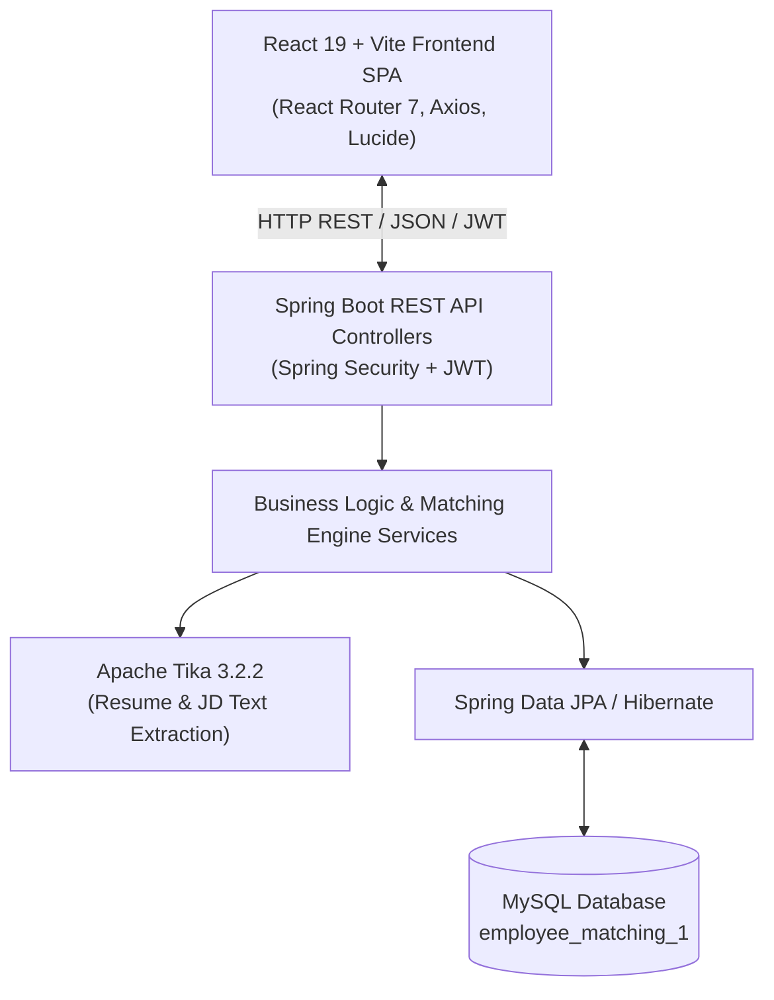
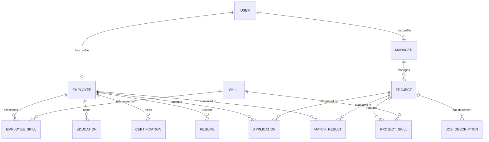

# 📑 Comprehensive Project Analysis: Employee Matching Platform

## 1. Executive Summary
The **Employee Matching Platform** is an enterprise full-stack web application designed to automatically match employees with open internal projects based on skill proficiency, professional experience, active certifications, and department alignment. 

It features automated document parsing (resumes & job descriptions) using Apache Tika, a 5-factor algorithmic scoring engine, role-based access control (EMPLOYEE, MANAGER, ADMIN), and a responsive React single-page application (SPA).

---

## 2. Technology Stack & Architecture



### Backend Architecture
* **Framework:** Java 21, Spring Boot `4.1.0`
* **Security:** Spring Security with stateless JWT (`jjwt 0.12.6`), BCrypt password hashing.
* **Database & Persistence:** Spring Data JPA, Hibernate DDL auto-update, MySQL Connector/J (`jdbc:mysql://localhost:3306/employee_matching_1`).
* **Document Processing:** Apache Tika Core & Parsers (`3.2.2`) for parsing PDF and DOCX documents.
* **Skill Extraction Engine:** RegEx pattern matcher against the global `Skill` entity database.

### Frontend Architecture
* **Framework & Build:** React `19.2.8`, Vite `8.2.0`
* **Routing & Guards:** React Router `7.18.2` with custom `ProtectedRoute` role guard and nested layouts (`EmployeeLayout`, `ManagerLayout`, `AdminLayout`, `AuthLayout`).
* **HTTP Client:** Custom `axiosClient` instance with request interceptors for automatic JWT attachment and response error handling.
* **Styling:** Vanilla CSS with custom glassmorphism design system, dark mode options, and responsive layouts.

---

## 3. Database Schema & Domain Model



### Domain Entities Summary
1. **`User`**: System credentials, role (`EMPLOYEE`, `MANAGER`, `ADMIN`).
2. **`Employee`**: User profile, designation, department, total experience (years).
3. **`Manager`**: User profile, department.
4. **`Skill`**: Pre-seeded global dictionary of technical & professional skills.
5. **`EmployeeSkill`**: Mapping of employee to skill with proficiency (1–5 scale) and years of experience.
6. **`Project`**: Title, description, department, required experience (years), status (`OPEN`, `CLOSED`).
7. **`ProjectSkill`**: Project skill requirement with `requiredProficiency` (1–5) and `importance` (1–5).
8. **`JobDescription`**: Uploaded project document, file path, extracted text, processing status.
9. **`Resume`**: Uploaded employee resume, file path, extracted text, processing status.
10. **`Application`**: Application state (`PENDING`, `APPROVED`, `REJECTED`), submission & update timestamps.
11. **`MatchResult`**: Composite match score and breakdown scores (Skills, Experience, Certification, Availability, Preference).
12. **`Education`**: Employee academic background (degree, institution, GPA, years).
13. **`Certification`**: Employee professional certifications, issue & expiry dates, credential URLs.

---

## 4. Core Algorithmic Match Engine (`MatchResultService`)

The matching algorithm computes a weighted score between **0.00% and 100.00%**:

$$\text{Overall Score} = (0.50 \times S) + (0.30 \times E) + (0.10 \times C) + (0.05 \times A) + (0.05 \times P)$$

### Score Breakdown Components
| Component | Weight | Calculation Logic |
| :--- | :--- | :--- |
| **Skills Score ($S$)** | **50%** | $\frac{\sum (\text{Ratio}_i \times \text{Importance}_i)}{\sum \text{Importance}_i}$ where $\text{Ratio}_i = \min(1.0, \frac{\text{EmpProf}}{\text{ReqProf}})$. |
| **Experience Score ($E$)** | **30%** | $\min\left(1.0, \frac{\text{Employee Experience (yrs)}}{\text{Project Required Experience (yrs)}}\right)$. |
| **Certification Score ($C$)** | **30%** | $\min(1.0, \text{Active/Unexpired Certifications} \times 0.50)$. |
| **Availability Score ($A$)** | **5%** | Standardized baseline factor (1.0). |
| **Preference Score ($P$)** | **5%** | 1.0 if Employee Department matches Project Department; 0.5 otherwise. |

#### Match Explanation Feature
The backend endpoint `/api/match-results/{id}/explanation` returns exact point contributions (e.g. 50 pts max for skills, 30 pts for experience), along with a explicit list of **Matched Skills** and **Missing Skills**, displayed visually in the frontend `MatchExplanationModal.jsx`.

---

## 5. Security & Access Control Matrix

| Endpoint Group | `EMPLOYEE` | `MANAGER` | `ADMIN` | Unauthenticated |
| :--- | :---: | :---: | :---: | :---: |
| `/api/auth/**` | Access | Access | Access | **Permitted** |
| `/api/employees/**` | **Access** | Denied | Denied | Denied |
| `/api/certifications/**` | **Access** | Denied | Denied | Denied |
| `/api/managers/**` | Denied | **Access** | Denied | Denied |
| `/api/admin/**` | Denied | Denied | **Access** | Denied |
| `/api/applications/**` | Access | Access | Access | Denied |
| `/api/skills/**` | Access | Access | Access | Denied |
| `/api/match-results/**` | Access | Access | Access | Denied |

---

## 6. Frontend Navigation & Pages Structure

```
frontend/src/
├── api/                   # API Axios services (match, project, auth, resume, etc.)
├── components/            # Reusable UI components & modals (MatchExplanationModal, SkillAutocomplete, Sidebar, Navbar)
├── context/               # AuthContext for global user state & JWT management
├── layouts/               # AdminLayout, EmployeeLayout, ManagerLayout, AuthLayout
├── pages/
│   ├── LandingPage.jsx    # Modern landing hero & platform overview
│   ├── admin/             # Admin Dashboard & User Management
│   ├── auth/              # Login & Registration forms
│   ├── employee/          # Profile, Skills, Qualifications, Resume, Project Explore, Matches, Applications
│   └── manager/           # Dashboard, Projects, Create Project, Match Candidates, Review Applications
└── routes/AppRoutes.jsx   # Client-side routing with role guards
```

---

## 7. Key Features & Strengths
1. **Automated Skill Extraction:** Resumes & JDs are parsed using Apache Tika and cross-referenced against the pre-seeded skills dictionary.
2. **Explainable AI/Matching:** Transparent, explainable matching breakdown showing exactly why an employee scored a specific percentage.
3. **Atomic Upsert Match Calculations:** Match results persist in the database using a composite key (`employee_id`, `project_id`) for high performance and fast retrieval.
4. **Role Separation:** Clear separation of portals and capabilities between job seekers (Employees), project owners (Managers), and platform governors (Admins).
